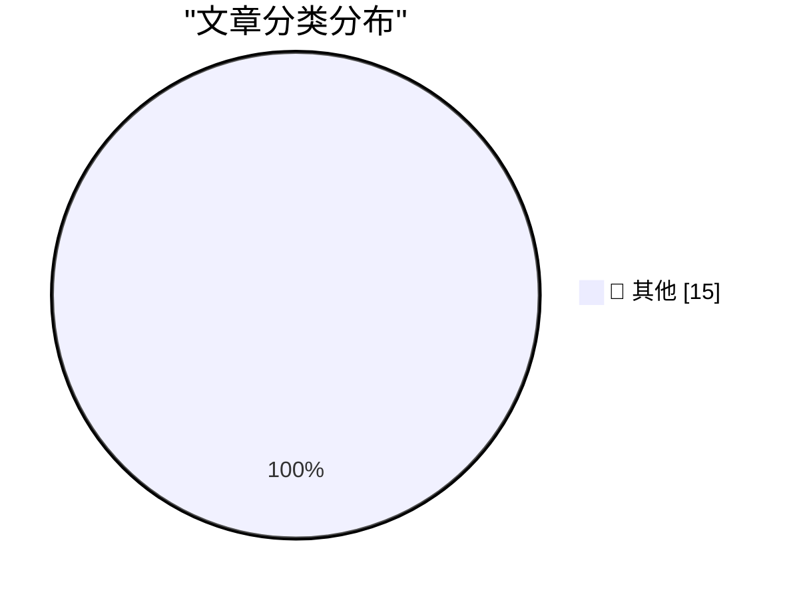

# 📰 AI 博客每日精选 — 2026-02-19

> 来自 Karpathy 推荐的 92 个顶级技术博客，AI 精选 Top 15

## 🏆 今日必读

🥇 **LadybirdBrowser/ladybird: Abandon Swift adoption**

[LadybirdBrowser/ladybird: Abandon Swift adoption](https://simonwillison.net/2026/Feb/19/ladybird/#atom-everything) — simonwillison.net · 2 小时前 · 📝 其他

> LadybirdBrowser/ladybird: Abandon Swift adoption

🥈 **Typing without having to type**

[Typing without having to type](https://simonwillison.net/2026/Feb/18/typing/#atom-everything) — simonwillison.net · 9 小时前 · 📝 其他

> Typing without having to type

🥉 **The A.I. Disruption We’ve Been Waiting for Has Arrived**

[The A.I. Disruption We’ve Been Waiting for Has Arrived](https://simonwillison.net/2026/Feb/18/the-ai-disruption/#atom-everything) — simonwillison.net · 11 小时前 · 📝 其他

> The A.I. Disruption We’ve Been Waiting for Has Arrived

---

## 📊 数据概览

| 扫描源 | 抓取文章 | 时间范围 | 精选 |
|:---:|:---:|:---:|:---:|
| 86/92 | 2164 篇 → 39 篇 | 48h | **15 篇** |

### 分类分布

---

## 📝 其他

### 1. LadybirdBrowser/ladybird: Abandon Swift adoption

[LadybirdBrowser/ladybird: Abandon Swift adoption](https://simonwillison.net/2026/Feb/19/ladybird/#atom-everything) — **simonwillison.net** · 2 小时前 · ⭐ 15/30

> LadybirdBrowser/ladybird: Abandon Swift adoption

---

### 2. Typing without having to type

[Typing without having to type](https://simonwillison.net/2026/Feb/18/typing/#atom-everything) — **simonwillison.net** · 9 小时前 · ⭐ 15/30

> Typing without having to type

---

### 3. The A.I. Disruption We’ve Been Waiting for Has Arrived

[The A.I. Disruption We’ve Been Waiting for Has Arrived](https://simonwillison.net/2026/Feb/18/the-ai-disruption/#atom-everything) — **simonwillison.net** · 11 小时前 · ⭐ 15/30

> The A.I. Disruption We’ve Been Waiting for Has Arrived

---

### 4. Quoting Martin Fowler

[Quoting Martin Fowler](https://simonwillison.net/2026/Feb/18/martin-fowler/#atom-everything) — **simonwillison.net** · 11 小时前 · ⭐ 15/30

> Quoting Martin Fowler

---

### 5. Introducing Claude Sonnet 4.6

[Introducing Claude Sonnet 4.6](https://simonwillison.net/2026/Feb/17/claude-sonnet-46/#atom-everything) — **simonwillison.net** · 1 天前 · ⭐ 15/30

> Introducing Claude Sonnet 4.6

---

### 6. Rodney v0.4.0

[Rodney v0.4.0](https://simonwillison.net/2026/Feb/17/rodney/#atom-everything) — **simonwillison.net** · 1 天前 · ⭐ 15/30

> Rodney v0.4.0

---

### 7. Quoting ROUGH DRAFT 8/2/66

[Quoting ROUGH DRAFT 8/2/66](https://simonwillison.net/2026/Feb/17/rough-draft-8266/#atom-everything) — **simonwillison.net** · 1 天前 · ⭐ 15/30

> Quoting ROUGH DRAFT 8/2/66

---

### 8. First kākāpō chick in four years hatches on Valentine's Day

[First kākāpō chick in four years hatches on Valentine's Day](https://simonwillison.net/2026/Feb/17/first-kakapo-chick-in-four-years/#atom-everything) — **simonwillison.net** · 1 天前 · ⭐ 15/30

> First kākāpō chick in four years hatches on Valentine's Day

---

### 9. Quoting Dimitris Papailiopoulos

[Quoting Dimitris Papailiopoulos](https://simonwillison.net/2026/Feb/17/dimitris-papailiopoulos/#atom-everything) — **simonwillison.net** · 1 天前 · ⭐ 15/30

> Quoting Dimitris Papailiopoulos

---

### 10. Nano Banana Pro diff to webcomic

[Nano Banana Pro diff to webcomic](https://simonwillison.net/2026/Feb/17/release-notes-webcomic/#atom-everything) — **simonwillison.net** · 1 天前 · ⭐ 15/30

> Nano Banana Pro diff to webcomic

---

### 11. Qwen3.5: Towards Native Multimodal Agents

[Qwen3.5: Towards Native Multimodal Agents](https://simonwillison.net/2026/Feb/17/qwen35/#atom-everything) — **simonwillison.net** · 1 天前 · ⭐ 15/30

> Qwen3.5: Towards Native Multimodal Agents

---

### 12. Frigate with Hailo for object detection on a Raspberry Pi

[Frigate with Hailo for object detection on a Raspberry Pi](https://www.jeffgeerling.com/blog/2026/frigate-with-hailo-for-object-detection-on-a-raspberry-pi/) — **jeffgeerling.com** · 7 小时前 · ⭐ 15/30

> Frigate with Hailo for object detection on a Raspberry Pi

---

### 13. Paul Ford: ‘The A.I. Disruption Has Arrived, and It Sure Is Fun’

[Paul Ford: ‘The A.I. Disruption Has Arrived, and It Sure Is Fun’](https://www.nytimes.com/2026/02/18/opinion/ai-software.html?unlocked_article_code=1.NFA.djaw.TBlAp8kE_N-i) — **daringfireball.net** · 7 小时前 · ⭐ 15/30

> Paul Ford: ‘The A.I. Disruption Has Arrived, and It Sure Is Fun’

---

### 14. Apple Invites Media to Special ‘Experience’ in New York, London, and Shanghai on March 4

[Apple Invites Media to Special ‘Experience’ in New York, London, and Shanghai on March 4](https://www.macrumors.com/2026/02/16/apple-announces-special-event-in-new-york/) — **daringfireball.net** · 1 天前 · ⭐ 15/30

> Apple Invites Media to Special ‘Experience’ in New York, London, and Shanghai on March 4

---

### 15. ★ Apple Releases iOS 26 Adoption Rates, and They’re Pretty Much in Line With the Last Few Years

[★ Apple Releases iOS 26 Adoption Rates, and They’re Pretty Much in Line With the Last Few Years](https://daringfireball.net/2026/02/apple_releases_ios_26_adoption_rates) — **daringfireball.net** · 1 天前 · ⭐ 15/30

> ★ Apple Releases iOS 26 Adoption Rates, and They’re Pretty Much in Line With the Last Few Years

---

*生成于 2026-02-19 04:23 | 扫描 86 源 → 获取 2164 篇 → 精选 15 篇*
*基于 [Hacker News Popularity Contest 2025](https://refactoringenglish.com/tools/hn-popularity/) RSS 源列表，由 [Andrej Karpathy](https://x.com/karpathy) 推荐*
*由「懂点儿AI」制作，欢迎关注同名微信公众号获取更多 AI 实用技巧 💡*
