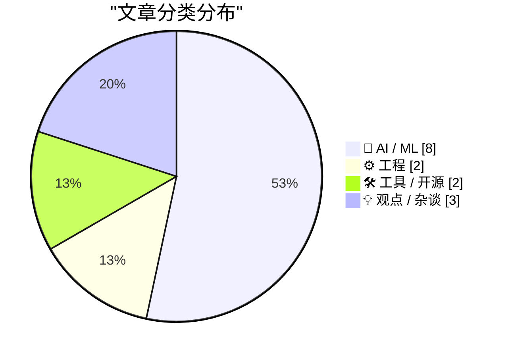
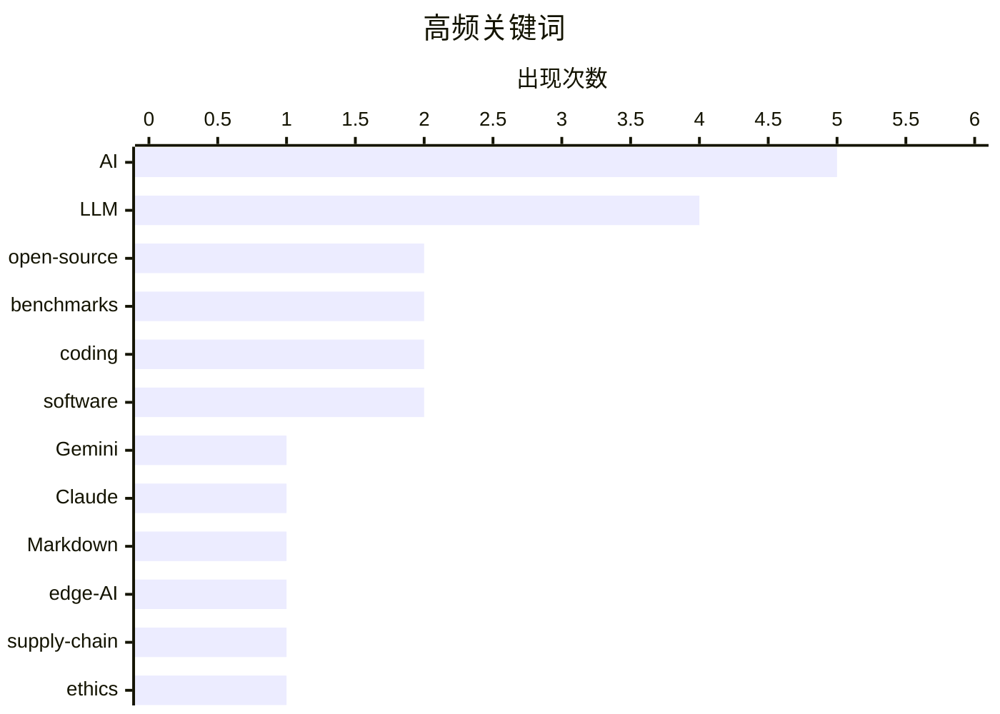

# 📰 AI 博客每日精选 — 2026-02-20

> 来自 Karpathy 推荐的 92 个顶级技术博客，AI 精选 Top 15

## 📝 今日看点

AI 模型竞赛进入白热化阶段——Google 发布 Gemini 3.1 Pro，Anthropic 推出 Claude Sonnet 4.6，SWE-bench 独立测评同步更新，性能-价格比持续刷新纪录。与此同时，AI 对行业的深层冲击正在多条战线展开：Paul Ford 在纽约时报宣告"AI 颠覆已至"，Martin Fowler 警告 LLM 正在吞噬专业技能分工，Anil Dash 则追问 AI 对儿童安全的系统性威胁。开源生态也面临新挑战——Ladybird 浏览器放弃 Swift 选型，维护者们集体抱怨 AI 生成的垃圾 PR 正在淹没仓库，行业开始重新思考"开放"与"质量"之间的平衡。

---

## 🏆 今日必读

🥇 **SWE-bench 2026年2月排行榜更新**

[SWE-bench February 2026 leaderboard update](https://simonwillison.net/2026/Feb/19/swe-bench/#atom-everything) — simonwillison.net · 19 小时前 · 🤖 AI / ML

> SWE-bench 发布了 2026 年 2 月的独立评测结果，对当前主流 AI 编程模型进行了全面测试。与以往各厂商自行报告分数不同，这次排行榜由第三方统一运行「Bash Only」测试，确保结果可比较且可信。当前一代模型在代码修复任务上的表现持续提升，AI 辅助编程正从"玩具"走向实用。独立基准测试对于客观评估模型能力至关重要。

💡 **为什么值得读**: 第三方独立测评比厂商自报分数更有参考价值，是了解 AI 编程现状的必读榜单。

🏷️ SWE-bench, benchmarks, LLM, coding

🥈 **Google 发布 Gemini 3.1 Pro**

[Gemini 3.1 Pro](https://simonwillison.net/2026/Feb/19/gemini-31-pro/#atom-everything) — simonwillison.net · 6 小时前 · 🤖 AI / ML

> Google 发布 Gemini 3.1 系列首款模型 Gemini 3.1 Pro，定价与 Gemini 3 Pro 持平（输入 $2/百万 token，输出 $12/百万 token），不到 Claude Opus 4.6 价格的一半，但基准测试分数相近。该模型在 SVG 动画生成等任务上相比前代有明显提升。AI 模型价格战进入新阶段，用户以更低成本即可获得接近顶级的性能。

💡 **为什么值得读**: 顶级模型的性能-价格比快速提升，对开发者选型和成本控制有直接影响。

🏷️ Gemini, Google, LLM, benchmarks

🥉 **Paul Ford: 我们等待的 AI 颠覆已经到来**

[The A.I. Disruption We've Been Waiting for Has Arrived](https://simonwillison.net/2026/Feb/18/the-ai-disruption/#atom-everything) — simonwillison.net · 1 天前 · 🤖 AI / ML

> 知名科技作家 Paul Ford 在纽约时报发表专栏，描述自己在 AI 面前复杂的心态——"我喜欢的人都讨厌它，讨厌的人都喜欢它，但我却兴奋得不行"。他生动描绘了 AI 带来的"十一月时刻"，认为软件行业正在经历真正的颠覆，而非此前的炒作。Simon Willison 对此文做了详细引评，提炼出多个值得深思的观点。这篇文章代表了技术社区中理性又不失热情的 AI 观察视角。

💡 **为什么值得读**: Paul Ford 是科技写作领域的标杆人物，他对 AI 浪潮的观察角度独特且坦诚。

🏷️ AI, disruption, Paul Ford, software

---

## 📊 数据概览

| 扫描源 | 抓取文章 | 时间范围 | 精选 |
|:---:|:---:|:---:|:---:|
| 87/92 | 2165 篇 → 33 篇 | 48h | **15 篇** |

### 分类分布

### 高频关键词

### 🏷️ 话题标签

**AI**(5) · **LLM**(4) · **open-source**(2) · **benchmarks**(2) · **coding**(2) · **software**(2) · Gemini(1) · Claude(1) · Markdown(1) · edge-AI(1) · supply-chain(1) · ethics(1) · disruption(1) · Swift(1) · Ladybird(1) · type-hints(1) · NAND(1) · gatekeeping(1) · AWS(1) · Raspberry-Pi(1)

---

## 🤖 AI / ML

### 1. SWE-bench 2026年2月排行榜更新

[SWE-bench February 2026 leaderboard update](https://simonwillison.net/2026/Feb/19/swe-bench/#atom-everything) — **simonwillison.net** · 19 小时前 · ⭐ 27/30

> SWE-bench 发布了 2026 年 2 月的独立评测结果，对当前主流 AI 编程模型进行了全面测试。与以往各厂商自行报告分数不同，这次排行榜由第三方统一运行「Bash Only」测试，确保结果可比较且可信。当前一代模型在代码修复任务上的表现持续提升，AI 辅助编程正从"玩具"走向实用。独立基准测试对于客观评估模型能力至关重要。

🏷️ SWE-bench, benchmarks, LLM, coding

### 2. Google 发布 Gemini 3.1 Pro

[Gemini 3.1 Pro](https://simonwillison.net/2026/Feb/19/gemini-31-pro/#atom-everything) — **simonwillison.net** · 6 小时前 · ⭐ 26/30

> Google 发布 Gemini 3.1 系列首款模型 Gemini 3.1 Pro，定价与 Gemini 3 Pro 持平（输入 $2/百万 token，输出 $12/百万 token），不到 Claude Opus 4.6 价格的一半，但基准测试分数相近。该模型在 SVG 动画生成等任务上相比前代有明显提升。AI 模型价格战进入新阶段，用户以更低成本即可获得接近顶级的性能。

🏷️ Gemini, Google, LLM, benchmarks

### 3. Paul Ford: 我们等待的 AI 颠覆已经到来

[The A.I. Disruption We've Been Waiting for Has Arrived](https://simonwillison.net/2026/Feb/18/the-ai-disruption/#atom-everything) — **simonwillison.net** · 1 天前 · ⭐ 26/30

> 知名科技作家 Paul Ford 在纽约时报发表专栏，描述自己在 AI 面前复杂的心态——"我喜欢的人都讨厌它，讨厌的人都喜欢它，但我却兴奋得不行"。他生动描绘了 AI 带来的"十一月时刻"，认为软件行业正在经历真正的颠覆，而非此前的炒作。Simon Willison 对此文做了详细引评，提炼出多个值得深思的观点。这篇文章代表了技术社区中理性又不失热情的 AI 观察视角。

🏷️ AI, disruption, Paul Ford, software

### 4. Anthropic 发布 Claude Sonnet 4.6

[Introducing Claude Sonnet 4.6](https://simonwillison.net/2026/Feb/17/claude-sonnet-46/#atom-everything) — **simonwillison.net** · 2 天前 · ⭐ 25/30

> Anthropic 发布 Claude Sonnet 4.6，声称性能接近去年 11 月推出的 Opus 4.5，但保持 Sonnet 系列定价（输入 $3/百万、输出 $15/百万 token），远低于 Opus 的 $5/$25。这意味着开发者可以用中端价格获得接近旗舰级的能力。AI 模型的"性能下放"趋势明显，顶级能力正快速向低价位段扩散。

🏷️ Claude, Anthropic, Sonnet, LLM

### 5. AI 正在成为 NAND 芯片的最大消费者

[AI is a NAND Maximiser](https://shkspr.mobi/blog/2026/02/ai-is-a-nand-maximiser/) — **shkspr.mobi** · 11 小时前 · ⭐ 24/30

> NVIDIA Vera Rubin 如果出货数千万台，每台需要 20TB 以上 SSD，将消耗去年全球 NAND 产能的约 20%。AI 对算力的需求正从 GPU 蔓延到存储芯片领域，开始影响整个半导体供应链。Phison CEO 在采访中直言，这种资源争夺将对消费级存储市场产生连锁反应。AI 不只是在"吃"算力，它正在"吃"整个芯片产业。

🏷️ AI, NAND, chips, supply-chain

### 6. Martin Fowler: LLM 正在吞噬专业技能

[Quoting Martin Fowler](https://simonwillison.net/2026/Feb/18/martin-fowler/#atom-everything) — **simonwillison.net** · 1 天前 · ⭐ 23/30

> Martin Fowler 发表观点称，LLM 正在"吞噬"前端/后端等专业分工，驾驭 LLM 的能力正变得比掌握特定平台技术更重要。他提出了一个关键问题：这是否会催生"专家通才"（Expert Generalists）的时代，还是 LLM 会用大量代码绕过技术孤岛而非真正打通它们？这一观点引发了关于软件工程师未来角色定位的深度思考。

🏷️ LLM, generalist, Martin Fowler, software-engineering

### 7. 我们怎么走到了用 AI 威胁孩子安全的地步？

[How did we end up threatening our kids' lives with AI?](https://anildash.com/2026/02/18/threatening-kids-with-AI/) — **anildash.com** · 2 天前 · ⭐ 23/30

> Anil Dash 发表长文探讨 AI 大公司的产品决策对儿童安全带来的严重威胁。他指出，讨论 AI 的"好处"时，我们不能回避它在未成年人保护方面的系统性失败。文章警告说，Big AI 公司的选择正在影响最脆弱的群体，而行业和监管的反应远远落后。这是一篇要求 AI 行业直面伦理责任的严肃呼吁。

🏷️ AI, children, safety, ethics

### 8. 在树莓派上用 Hailo AI 加速卡运行 Frigate 物体检测

[Frigate with Hailo for object detection on a Raspberry Pi](https://www.jeffgeerling.com/blog/2026/frigate-with-hailo-for-object-detection-on-a-raspberry-pi/) — **jeffgeerling.com** · 1 天前 · ⭐ 21/30

> Jeff Geerling 测试了在 Raspberry Pi 5 上使用 Hailo AI HAT+ 加速卡运行 Frigate NVR 系统的完整流程。从传统的 Coral TPU USB 方案迁移到 Hailo 方案，探索了边缘 AI 推理在家庭安防场景中的实际表现。文章详细记录了硬件配置、性能对比和踩坑经验。边缘 AI 推理方案的成熟度正在快速提升。

🏷️ Raspberry-Pi, Hailo, edge-AI, object-detection

---

## ⚙️ 工程

### 9. 不用亲手打字的"打字"——AI 时代类型系统的新价值

[Typing without having to type](https://simonwillison.net/2026/Feb/18/typing/#atom-everything) — **simonwillison.net** · 1 天前 · ⭐ 23/30

> Simon Willison 分享了一个有趣的转变：编程 25 年来一直抵触类型标注（因为它拖慢迭代速度），如今因为 coding agent 代替自己写代码，类型系统的好处突然变得极其有吸引力。当"打字"的工作交给 AI 后，显式定义类型带来的安全性和可维护性收益远超成本。这一观察揭示了 AI 辅助编程如何反过来改变开发者对工具和范式的偏好。

🏷️ type-hints, coding-agents, developer-tools, static-typing

### 10. 意识流驱动开发

[Stream of Consciousness Driven Development](https://buttondown.com/hillelwayne/archive/stream-of-consciousness-driven-development/) — **buttondown.com/hillelwayne** · 1 天前 · ⭐ 20/30

> Hillel Wayne 分享了一种新的开发方法论：遇到复杂问题时，不急于口头解释，而是创建一个 Markdown 文件，以意识流的方式把问题、分析和解决方案一股脑写下来。这种方法将思考过程外化为文档，既帮助自己理清思路，也为团队提供了可追溯的决策记录。虽然还未经大规模验证，但初步实践显示出很好的效果。

🏷️ development, methodology, specification, writing

---

## 🛠 工具 / 开源

### 11. Ladybird 浏览器宣布放弃采用 Swift

[LadybirdBrowser/ladybird: Abandon Swift adoption](https://simonwillison.net/2026/Feb/19/ladybird/#atom-everything) — **simonwillison.net** · 22 小时前 · ⭐ 24/30

> 2024 年 8 月 Ladybird 浏览器曾宣布选择 Swift 作为内存安全语言方案，如今正式放弃这一决定。该项目在实际使用中遇到了 Swift 与 C++ 互操作的困难，最终选择转向其他方案。这一决策反映了新兴编程语言在"选型 → 实践 → 评估"过程中的真实挑战。对于关注浏览器引擎和编程语言生态的开发者来说，这是一个有警示意义的案例。

🏷️ Ladybird, Swift, browser, open-source

### 12. Markdown 迎来高光时刻

[Markdown's Moment](https://feed.tedium.co/link/15204/17278321/markdown-growing-influence-cloudflare-ai) — **tedium.co** · 2 天前 · ⭐ 22/30

> 多家大型公司（包括 Cloudflare）正在大力拥抱 Markdown 格式，背后推手很可能是 AI。LLM 以 Markdown 作为原生输出格式，推动了整个行业对这一轻量标记语言的重新重视。作者认为，虽然 AI 驱动是主因，但 Markdown 普及带来的附带好处——更好的内容可移植性和标准化——同样令人期待。一个诞生于 2004 年的简单格式，正因 AI 浪潮获得"第二春"。

🏷️ Markdown, Cloudflare, AI, content

---

## 💡 观点 / 杂谈

### 13. 未来是否是"万物皆 AWS"？

[Is the Future "AWS for Everything"?](https://www.construction-physics.com/p/is-the-future-aws-for-everything) — **construction-physics.com** · 10 小时前 · ⭐ 22/30

> 文章从制造业效率提升的历史出发，探讨了"AWS 模式"（即把复杂能力打包成按需服务）是否会扩展到所有行业。核心论点是：效率改进历来依赖重复性生产，而云服务模式本质上就是将重复性推向极致。当 AI 让更多领域实现标准化和服务化，"一切即服务"可能不再只是口号。

🏷️ AWS, cloud, platform, efficiency

### 14. 为什么我们需要"守门人"——开源世界的 AI 垃圾危机

[The case for gatekeeping, or: why medieval guilds had it figured out](https://www.joanwestenberg.com/the-case-for-gatekeeping-or-why-medieval-guilds-had-it-figured-out/) — **joanwestenberg.com** · 2 天前 · ⭐ 22/30

> 过去半年里几乎所有开源维护者都在抱怨同一件事：AI 生成的低质量 PR 像洪水般涌入仓库，这些贡献"看起来像回事"——有 commit message、引用 issue——但本质是垃圾。作者以中世纪行会制度为喻，认为适度的准入门槛不是精英主义，而是保护社区质量的必要手段。文章呼吁开源社区重新审视"开放"与"质量"之间的平衡。

🏷️ open-source, AI-slop, gatekeeping, quality

### 15. 思考让思考变得更好

[Thinking Improves Thinking](https://idiallo.com/blog/taking-our-mind-for-granted?src=feed) — **idiallo.com** · 1 天前 · ⭐ 20/30

> 在 ChatGPT 时代，我们是如何写出完整句子、将想法串成连贯论述、解决没有现成答案的问题的？答案很简单——我们曾经"思考"过。作者认为，人类的思考能力本身就是可以通过练习提升的，而过度依赖 AI 代替思考可能导致这一核心能力的退化。有时候最好的解决方案就来自散步时大脑在后台的默默运转。

🏷️ thinking, AI, cognition, creativity

---

*生成于 2026-02-20 07:30 | 扫描 92 源 → 获取 2165 篇 → 精选 15 篇*
*基于 [Hacker News Popularity Contest 2025](https://refactoringenglish.com/tools/hn-popularity/) RSS 源列表，由 [Andrej Karpathy](https://x.com/karpathy) 推荐*
*由「懂点儿AI」制作，欢迎关注同名微信公众号获取更多 AI 实用技巧 💡*
