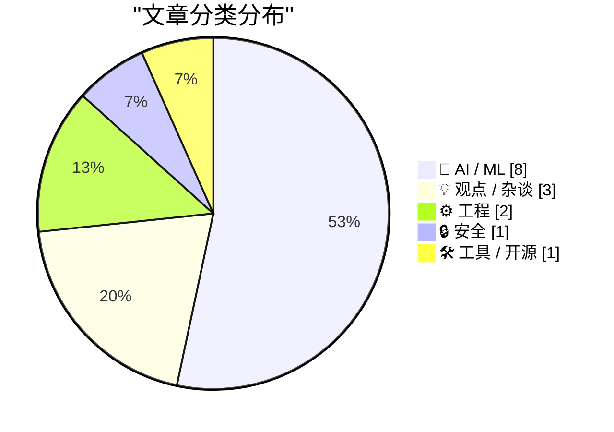
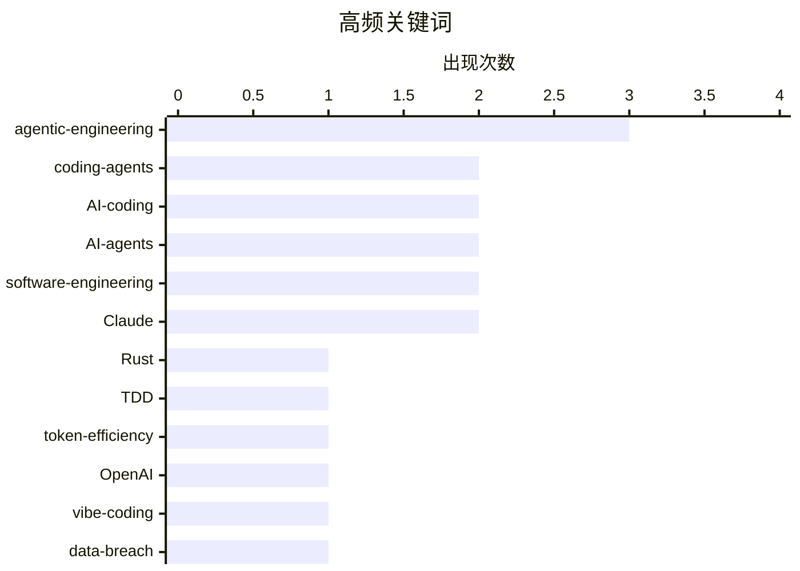

# 📰 AI 博客每日精选 — 2026-02-24

> 来自 Karpathy 推荐的 92 个顶级技术博客，AI 精选 Top 15

## 📝 今日看点

AI 辅助编程正从尝鲜进入工程化阶段。Simon Willison 启动了系统性的「Agentic Engineering Patterns」文档项目，从红绿 TDD、代码经济学等多维度建立 AI 编码最佳实践体系；Ladybird 浏览器借助 AI 完成了从 Swift 到 Rust 的大规模迁移，证明了 AI 在严肃系统工程中的实战能力。与此同时，行业批评声浪不减——Gary Marcus 宣称生成式 AI 是「骗局」，多位观察者指出 AI 创业存在系统性方向偏差。今天的技术圈正在两极分化：一边是越来越成熟的 AI 工程实践，一边是越来越尖锐的价值质疑。

---

## 🏆 今日必读

🥇 **Ladybird 浏览器正式采用 Rust，AI 辅助完成迁移**

[Ladybird adopts Rust, with help from AI](https://simonwillison.net/2026/Feb/23/ladybird-adopts-rust/#atom-everything) — simonwillison.net · 6 小时前 · ⚙️ 工程

> Ladybird 浏览器项目在等待 Swift 跨平台支持数年未果后，正式转向 Rust 作为其内存安全语言。项目创始人 Andreas Kling 详细分享了如何借助 AI 编码代理来辅助完成关键库的移植工作，展示了 AI 在大型代码迁移项目中的实际应用。这一案例揭示了 AI 辅助编程不仅能处理简单任务，还能在严肃的系统级项目中发挥关键作用。对于考虑语言迁移或大规模代码重构的团队来说，这是一个极具参考价值的实践样本。

💡 **为什么值得读**: 展示了 AI 辅助编程在生产级系统项目中的真实应用场景，对 Rust 和 AI coding 感兴趣的开发者不容错过。

🏷️ Ladybird, Rust, AI-coding, browser

🥈 **Simon Willison 启动「Agentic 工程模式」系列文档**

[Writing about Agentic Engineering Patterns](https://simonwillison.net/2026/Feb/23/agentic-engineering-patterns/#atom-everything) — simonwillison.net · 7 小时前 · 🤖 AI / ML

> Simon Willison 启动了一个全新项目，系统收集和记录 Agentic Engineering Patterns——利用 Claude Code、OpenAI Codex 等编码代理进行软件开发的最佳实践。他用「Agentic Engineering」来指代使用编码代理构建软件的全新工作方式，强调这与传统软件开发有本质不同。该系列文档旨在帮助开发者在这个编码代理新时代中获得最佳开发效果。这是目前对 AI 辅助开发实践最系统的梳理之一。

💡 **为什么值得读**: 系统梳理了 AI 编码代理的工程实践，是每个使用 AI 工具写代码的开发者的必备参考。

🏷️ agentic-engineering, coding-agents, Claude-Code, best-practices

🥉 **「写代码变得便宜了」—— Agentic 工程的第一性原理**

[Writing code is cheap now](https://simonwillison.net/guides/agentic-engineering-patterns/code-is-cheap/#atom-everything) — simonwillison.net · 8 小时前 · 🤖 AI / ML

> Simon Willison 指出采用 Agentic Engineering 最大的挑战在于：接受「写代码已经变得廉价」这一事实及其带来的连锁反应。传统软件工程中，编写几百行整洁、经过测试的代码需要一整天甚至更长，我们的许多工程习惯都建立在代码昂贵的假设之上。编码代理改变了这一基本经济学，迫使我们重新审视从宏观架构决策到微观编码习惯的方方面面。这篇文章从第一性原理出发，剖析了 AI 如何从根本上改变软件工程的经济模型。

💡 **为什么值得读**: 从经济学视角重新定义了软件工程，理解这个观点对于适应 AI 时代的开发方式至关重要。

🏷️ agentic-engineering, code-economics, software-engineering, AI-disruption

---

## 📊 数据概览

| 扫描源 | 抓取文章 | 时间范围 | 精选 |
|:---:|:---:|:---:|:---:|
| 86/92 | 2166 篇 → 43 篇 | 48h | **15 篇** |

### 分类分布

### 高频关键词

### 🏷️ 话题标签

**agentic-engineering**(3) · **coding-agents**(2) · **AI-coding**(2) · **AI-agents**(2) · **software-engineering**(2) · **Claude**(2) · Rust(1) · TDD(1) · token-efficiency(1) · OpenAI(1) · vibe-coding(1) · data-breach(1) · formal-methods(1) · generative-AI(1) · continuous-learning(1)

---

## 🤖 AI / ML

### 1. Simon Willison 启动「Agentic 工程模式」系列文档

[Writing about Agentic Engineering Patterns](https://simonwillison.net/2026/Feb/23/agentic-engineering-patterns/#atom-everything) — **simonwillison.net** · 7 小时前 · ⭐ 26/30

> Simon Willison 启动了一个全新项目，系统收集和记录 Agentic Engineering Patterns——利用 Claude Code、OpenAI Codex 等编码代理进行软件开发的最佳实践。他用「Agentic Engineering」来指代使用编码代理构建软件的全新工作方式，强调这与传统软件开发有本质不同。该系列文档旨在帮助开发者在这个编码代理新时代中获得最佳开发效果。这是目前对 AI 辅助开发实践最系统的梳理之一。

🏷️ agentic-engineering, coding-agents, Claude-Code, best-practices

### 2.「写代码变得便宜了」—— Agentic 工程的第一性原理

[Writing code is cheap now](https://simonwillison.net/guides/agentic-engineering-patterns/code-is-cheap/#atom-everything) — **simonwillison.net** · 8 小时前 · ⭐ 26/30

> Simon Willison 指出采用 Agentic Engineering 最大的挑战在于：接受「写代码已经变得廉价」这一事实及其带来的连锁反应。传统软件工程中，编写几百行整洁、经过测试的代码需要一整天甚至更长，我们的许多工程习惯都建立在代码昂贵的假设之上。编码代理改变了这一基本经济学，迫使我们重新审视从宏观架构决策到微观编码习惯的方方面面。这篇文章从第一性原理出发，剖析了 AI 如何从根本上改变软件工程的经济模型。

🏷️ agentic-engineering, code-economics, software-engineering, AI-disruption

### 3. Claude C 编译器：它揭示了软件的未来

[The Claude C Compiler: What It Reveals About the Future of Software](https://simonwillison.net/2026/Feb/22/ccc/#atom-everything) — **simonwillison.net** · 1 天前 · ⭐ 25/30

> Anthropic 的 Nicholas Carlini 用并行 Claude 实例构建了一个 C 编译器，基于最新的 Opus 4.6 模型。LLVM/Clang/Swift 之父 Chris Lattner 从编译器专家角度深入分析了这个项目的意义，认为它揭示了 AI 驱动的软件开发未来的重要趋势。这不仅是一次技术展示，更是对 AI 能否理解和实现复杂系统级软件的一次严肃测试。Lattner 的专业分析为理解 AI 编程能力的边界和潜力提供了权威视角。

🏷️ Claude, C-compiler, AI-coding, Chris-Lattner

### 4. 红绿 TDD：让编码代理输出更可靠的简洁方法

[Red/green TDD](https://simonwillison.net/guides/agentic-engineering-patterns/red-green-tdd/#atom-everything) — **simonwillison.net** · 18 小时前 · ⭐ 24/30

> Simon Willison 提出「使用红/绿 TDD」是提升编码代理输出质量的最简洁有效方法。TDD（测试驱动开发）的核心是先写测试再写代码，确保每段代码都有自动化测试验证。在 Agentic Engineering 场景下，这一模式的价值被放大——先让代理看到失败的测试（红），再让它编写通过测试的代码（绿），可以显著减少代理产出的错误代码。这个模式简单易行，却能大幅提高 AI 编码的可靠性。

🏷️ TDD, agentic-engineering, testing, coding-agents

### 5. 19 个 Web 框架的 Token 效率基准测试：哪个最适合 AI 代理？

[Which web frameworks are most token-efficient for AI agents?](https://martinalderson.com/posts/which-web-frameworks-are-most-token-efficient-for-ai-agents/?utm_source=rss) — **martinalderson.com** · 1 天前 · ⭐ 23/30

> 作者对 19 个主流 Web 框架进行了系统性基准测试，衡量 AI 编码代理构建和扩展同一应用所消耗的 Token 数量。测试结果显示，轻量级框架比全功能框架最多可节省 2.9 倍的 Token 消耗。这一发现对于 AI 辅助开发的成本控制和框架选择有直接参考价值。报告为开发者在 AI 时代选择技术栈提供了一个全新的评估维度。

🏷️ web-frameworks, token-efficiency, AI-agents, benchmarks

### 6. AI 模型为何无法持续学习？部署后的「遗忘」困境

[What's so hard about continuous learning?](https://seangoedecke.com/continuous-learning/) — **seangoedecke.com** · 1 天前 · ⭐ 22/30

> 人类员工会随时间积累经验并成为领域专家，但 AI 模型不会——它们的能力在部署那一刻就被冻结了。模型权重一旦发布就无法更新，「学习」只能依赖塞进上下文窗口的有限信息。这篇文章清晰解释了为什么持续学习是 AI 领域最根本的挑战之一，以及当前的上下文窗口等方案为何只是权宜之计。对于理解 AI 系统的本质局限性，这是一篇必读的科普文章。

🏷️ continuous-learning, model-weights, context-window, AI-limitations

### 7. 理清 OpenAI Codex 的混乱命名

[How I think about Codex](https://simonwillison.net/2026/Feb/22/how-i-think-about-codex/#atom-everything) — **simonwillison.net** · 1 天前 · ⭐ 21/30

> OpenAI 开发者体验工程师 Gabriel Chua 试图厘清「Codex」这个在 OpenAI 生态中被反复使用的混乱术语。Codex 可以指代多个不同的产品和概念，包括 API 模型、编码代理等。他将 Codex 定义为 OpenAI 的软件工程代理，可通过多种接口使用，而代理本质上就是「模型加指令」。这篇文章为理解 OpenAI 的产品矩阵和 AI 编码工具的定位提供了清晰的框架。

🏷️ OpenAI, Codex, AI-agents, software-engineering

### 8. 如何应对 AI 对儿童造成的伤害？

[Taking action against AI harms](https://anildash.com/2026/02/23/taking-action-ai-harms/) — **anildash.com** · 45 分钟前 · ⭐ 20/30

> Anil Dash 继上篇讨论 AI 对儿童的伤害之后，本文转向行动层面——如何让那些做出不负责任决定的 AI 平台承担责任。文章分析了 AI 公司的激励机制和制度压力如何导致他们做出危害儿童的决策。面对「无力感」这一普遍反应，作者提出了具体的行动建议和参与途径。这篇文章将 AI 伦理讨论从抽象层面拉回到了可执行的行动方案。

🏷️ AI-ethics, children-safety, accountability, regulation

---

## 💡 观点 / 杂谈

### 9. Gary Marcus：生成式 AI 原来是场骗局

[Turns out Generative AI was a scam](https://garymarcus.substack.com/p/turns-out-generative-ai-was-a-scam) — **garymarcus.substack.com** · 10 小时前 · ⭐ 22/30

> AI 批评家 Gary Marcus 再次对生成式 AI 的实际价值发出质疑，认为当前的生成式 AI 远未达到业界宣传的水平。他系统性地论证了 GenAI 在可靠性、实用性和商业回报方面与预期之间的巨大差距。作为 AI 领域最知名的怀疑论者之一，Marcus 的观点虽然争议不断，但提供了一个有价值的逆向思考视角。无论你是否同意他的结论，了解批评者的论据有助于形成更全面的判断。

🏷️ generative-AI, AI-criticism, hype, Gary-Marcus

### 10. AI 创业者都在犯同一个错误

[Everyone in AI is building the wrong thing for the same reason](https://www.joanwestenberg.com/everyone-in-ai-is-building-the-wrong-thing-for-the-same-reason/) — **joanwestenberg.com** · 14 小时前 · ⭐ 22/30

> 作者观察到几乎所有 AI 创业者都感受到行业正以无法理解的速度朝着一个不太合理的方向狂奔，却不知道如何脱身。这篇文章剖析了 AI 行业的跟风效应：当所有人都在追逐同样的技术方向时，真正的创新反而被忽视。文章试图解释为什么整个行业存在系统性的方向偏差，以及这对创业者和投资者意味着什么。对于正在 AI 领域创业或投资的人来说，这是一次有价值的集体反思。

🏷️ AI-startups, product-strategy, industry-trends, groupthink

### 11. Paul Ford：解释 Vibe Coding，然后被全网骂

[Quoting Paul Ford](https://simonwillison.net/2026/Feb/23/paul-ford/#atom-everything) — **simonwillison.net** · 9 小时前 · ⭐ 19/30

> Paul Ford 在一篇文章中向普通读者解释了 Vibe Coding 现象，因为他认为「大事将至」并希望普通人能有所准备。但读者的反应不是感激而是愤怒——人们需要「发出尖叫声」而不是客观理解新事物。这段引用深刻反映了当前科技圈的舆论生态：即便出于善意的技术科普，也会成为社交媒体上的攻击靶心。

🏷️ vibe-coding, AI, public-discourse, media

---

## ⚙️ 工程

### 12. Ladybird 浏览器正式采用 Rust，AI 辅助完成迁移

[Ladybird adopts Rust, with help from AI](https://simonwillison.net/2026/Feb/23/ladybird-adopts-rust/#atom-everything) — **simonwillison.net** · 6 小时前 · ⭐ 26/30

> Ladybird 浏览器项目在等待 Swift 跨平台支持数年未果后，正式转向 Rust 作为其内存安全语言。项目创始人 Andreas Kling 详细分享了如何借助 AI 编码代理来辅助完成关键库的移植工作，展示了 AI 在大型代码迁移项目中的实际应用。这一案例揭示了 AI 辅助编程不仅能处理简单任务，还能在严肃的系统级项目中发挥关键作用。对于考虑语言迁移或大规模代码重构的团队来说，这是一个极具参考价值的实践样本。

🏷️ Ladybird, Rust, AI-coding, browser

### 13. Hillel Wayne：我写的一些有趣的 Z3 脚本

[New Blog Post: Some Silly Z3 Scripts I Wrote](https://buttondown.com/hillelwayne/archive/new-blog-post-some-silly-z3-scripts-i-wrote/) — **buttondown.com/hillelwayne** · 8 小时前 · ⭐ 17/30

> 形式化验证领域知名作者 Hillel Wayne 分享了他用 Z3 定理证明器编写的一系列有趣脚本。Z3 是微软开发的 SMT 求解器，在程序验证、约束求解等领域有广泛应用。这篇文章以轻松有趣的方式展示了形式化方法工具的实际用途，降低了普通开发者接触这类工具的门槛。作为《Logic for Programmers》作者，Wayne 让严肃的形式化方法变得平易近人。

🏷️ Z3, theorem-prover, formal-methods, SMT-solver

---

## 🔒 安全

### 14. Troy Hunt 安全周报 492：数据泄露与受害者知情权的鸿沟

[Weekly Update 492](https://www.troyhunt.com/weekly-update-492/) — **troyhunt.com** · 7 分钟前 · ⭐ 18/30

> 安全专家 Troy Hunt 在本周回顾中聚焦于数据泄露与个体受害者知情之间的巨大时间差。尽管人们倾向于将责任归咎于被黑客攻击的公司，但这些公司在应对犯罪入侵的同时也面临着赎金威胁等多重压力。这一话题触及了数据安全领域的核心痛点：信息披露的速度和透明度。对于关注数据安全和隐私保护的从业者来说，这是一期值得关注的周报。

🏷️ data-breach, privacy, disclosure, ransomware

---

## 🛠 工具 / 开源

### 15. Git 平台的「魔法文件夹」完全指南

[Forge-Specific Repository Folders](https://nesbitt.io/2026/02/22/forge-specific-repository-folders.html) — **nesbitt.io** · 1 天前 · ⭐ 17/30

> 这篇文章系统梳理了主流 Git 平台各自的特殊目录及其功能：.github/、.gitlab/、.gitea/、.forgejo/ 和 .bitbucket/。这些「魔法文件夹」在各自平台上承担着 CI/CD 配置、Issue 模板、安全策略等关键功能。文章提供了一个全面的参考索引，帮助开发者了解不同平台的差异和功能。对于需要在多个 Git 平台间工作的开发者来说，这是一篇实用的速查指南。

🏷️ git, GitHub, GitLab, repository-management

---

*生成于 2026-02-24 08:45 | 扫描 86 源 → 获取 2166 篇 → 精选 15 篇*
*基于 [Hacker News Popularity Contest 2025](https://refactoringenglish.com/tools/hn-popularity/) RSS 源列表，由 [Andrej Karpathy](https://x.com/karpathy) 推荐*
*由「懂点儿AI」制作，欢迎关注同名微信公众号获取更多 AI 实用技巧 💡*
