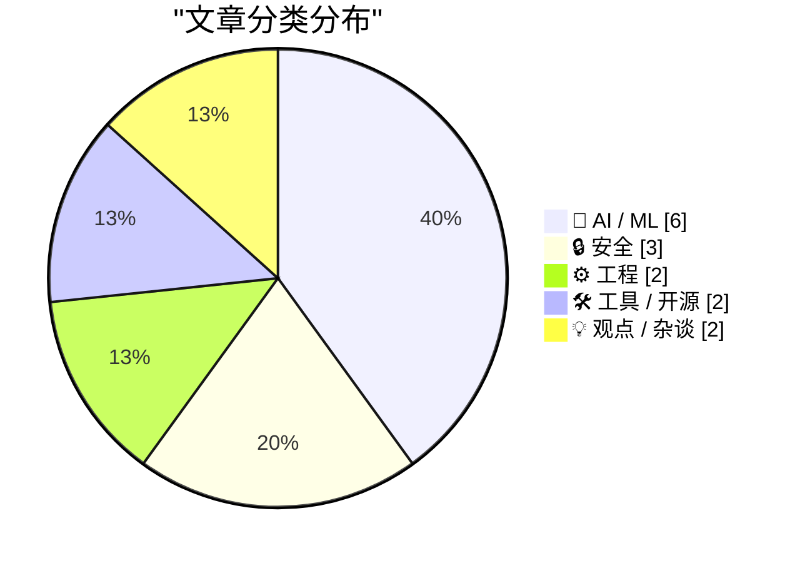
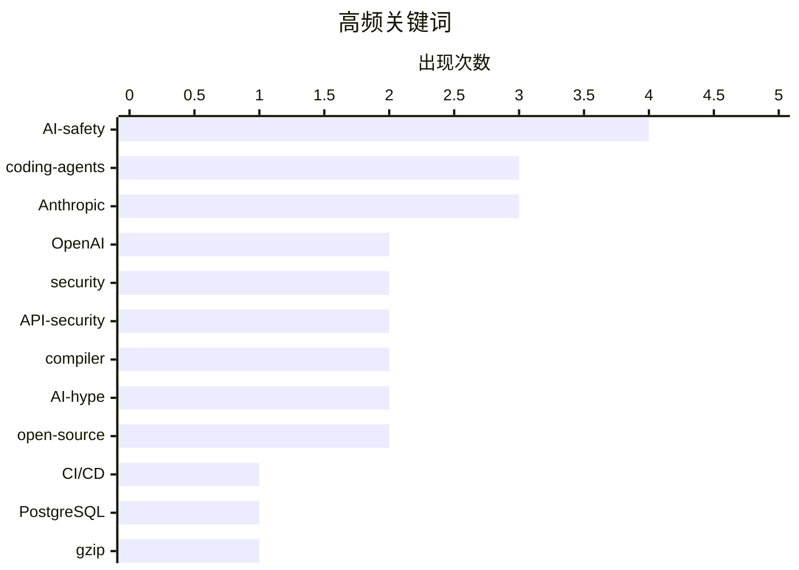

# 📰 AI 博客每日精选 — 2026-02-27

> 来自 Karpathy 推荐的 92 个顶级技术博客，AI 精选 Top 15

## 📝 今日看点

AI 安全与治理在今天被推到了聚光灯下。Anthropic CEO Dario Amodei 发表历史性声明回应五角大楼合作争议，退役美国空军上将 Jack Shanahan 更是直言"任何 LLM 都不应被用于全自主致命武器系统"。与此同时，Andrej Karpathy 宣称编程在过去两个月因 AI 发生了根本性变化——"编码 Agent 在去年 12 月之前基本不能用，之后基本能用了"——但对此也有截然相反的声音，Ed Zitron 犀利地指出 Claude Code 能生成完整 SaaS 产品的说法"完全是谎言"。安全领域同样警钟长鸣：Google API 密钥设计缺陷导致近 2,863 个本应公开的 Maps 密钥意外获得了访问 Gemini 私有文件的权限。Benedict Evans 则抛出了一个尖锐的问题：如果用户每周只用 ChatGPT 两次，那它真的改变了他们的生活吗？

---

## 🏆 今日必读

🥇 **Google API 密钥不再是秘密：Gemini 改变了游戏规则**

[Google API Keys Weren't Secrets. But then Gemini Changed the Rules.](https://simonwillison.net/2026/Feb/26/google-api-keys/#atom-everything) — simonwillison.net · 20 小时前 · 🔒 安全

> Google 的 API 密钥系统暴露出一个严重的安全设计缺陷：Google Maps 的 API 密钥被设计为可以公开嵌入网页，但当 Google 后来在同一项目上启用 Gemini API 时，这些公开密钥悄然获得了访问敏感 Gemini 端点的能力。Truffle Security 在公开网页爬取中发现了约 2,863 个可访问 Gemini 端点的暴露密钥，其中甚至包括 Google 自己在 2023 年就公开部署的密钥。正如文章所说，"密钥从公开标识符变成了秘密凭证"——而开发者对此毫不知情。

💡 **为什么值得读**: 这不是用户配置错误，而是 Google 的系统设计缺陷，可能影响数百万开发者的安全。

🏷️ Google, API-security, Gemini, credential-leak

🥈 **Dario Amodei 发表关于 AI 与国防的历史性声明**

[Historic statement from Dario Amodei](https://garymarcus.substack.com/p/historic-statement-from-dario-amodei) — garymarcus.substack.com · 1 小时前 · 🤖 AI / ML

> Anthropic CEO Dario Amodei 就公司与美国国防部的合作关系发表了一份被 Gary Marcus 称为"历史性"的声明。在 AI 军事化争议日益激烈的背景下，这份声明代表了 AI 行业领导者在安全与伦理问题上的明确表态。评论区有读者写道："这就是企业诚信的声音，而这种声音正变得越来越稀少。"在各大 AI 公司纷纷争抢政府合同的当下，Anthropic 的这一立场尤其值得关注。

💡 **为什么值得读**: AI 头部公司对军事化应用的表态，直接影响整个行业的安全与伦理走向。

🏷️ Anthropic, Dario-Amodei, AI-safety, military

🥉 **Andrej Karpathy：编程在过去两个月因 AI 彻底改变了**

[Quoting Andrej Karpathy](https://simonwillison.net/2026/Feb/26/andrej-karpathy/#atom-everything) — simonwillison.net · 5 小时前 · 🤖 AI / ML

> Karpathy 发表了一段引发广泛讨论的观点：AI 对编程的改变不是渐进式的"一切照旧"式进步，而是在去年 12 月发生了质变。他认为"编码 Agent 在去年 12 月之前基本不能用，之后基本能用了"——模型在质量、长期连贯性和韧性方面有了显著提升，能够处理大型、长期的项目。虽然他也承认存在很多需要注意的细节，但这一判断与许多开发者的亲身体验高度吻合。

💡 **为什么值得读**: 来自 AI 社区最有影响力的声音之一，对编码 Agent 能力跃升的第一手判断。

🏷️ Andrej-Karpathy, coding-agents, AI-programming, paradigm-shift

---

## 📊 数据概览

| 扫描源 | 抓取文章 | 时间范围 | 精选 |
|:---:|:---:|:---:|:---:|
| 86/92 | 2169 篇 → 57 篇 | 48h | **15 篇** |

### 分类分布

### 高频关键词

### 🏷️ 话题标签

**AI-safety**(4) · **coding-agents**(3) · **Anthropic**(3) · **OpenAI**(2) · **security**(2) · **API-security**(2) · **compiler**(2) · **AI-hype**(2) · **open-source**(2) · CI/CD(1) · PostgreSQL(1) · gzip(1) · Google(1) · Gemini(1) · credential-leak(1) · Dario-Amodei(1) · military(1) · Andrej-Karpathy(1) · AI-programming(1) · paradigm-shift(1) · NVIDIA(1) · analyslop(1) · product-market-fit(1) · ChatGPT(1) · agentic-engineering(1) · rent-seeking(1) · attestation(1) · EU-CRA(1) · NATO(1) · Apple(1) · query-based(1) · incremental-compilation(1) · Zig(1) · Rust(1) · OpenCode(1) · code-review(1) · AI-skepticism(1)

---

## 🤖 AI / ML

### 1. Dario Amodei 发表关于 AI 与国防的历史性声明

[Historic statement from Dario Amodei](https://garymarcus.substack.com/p/historic-statement-from-dario-amodei) — **garymarcus.substack.com** · 1 小时前 · ⭐ 27/30

> Anthropic CEO Dario Amodei 就公司与美国国防部的合作关系发表了一份被 Gary Marcus 称为"历史性"的声明。在 AI 军事化争议日益激烈的背景下，这份声明代表了 AI 行业领导者在安全与伦理问题上的明确表态。评论区有读者写道："这就是企业诚信的声音，而这种声音正变得越来越稀少。"

🏷️ Anthropic, Dario-Amodei, AI-safety, military

### 2. Andrej Karpathy：编程在过去两个月因 AI 彻底改变了

[Quoting Andrej Karpathy](https://simonwillison.net/2026/Feb/26/andrej-karpathy/#atom-everything) — **simonwillison.net** · 5 小时前 · ⭐ 27/30

> Karpathy 认为 AI 对编程的改变不是渐进式的，而是在去年 12 月发生了质变。"编码 Agent 在去年 12 月之前基本不能用，之后基本能用了"——模型在质量、长期连贯性和韧性方面有了显著提升，能够处理大型、长期的项目。这一判断与许多开发者的亲身体验高度吻合。

🏷️ Andrej-Karpathy, coding-agents, AI-programming, paradigm-shift

### 3. 退役美国空军上将：任何 LLM 都不应用于自主致命武器

[Retired US Air Force General Jack Shanahan on the Anthropic-Pentagon tensions](https://garymarcus.substack.com/p/retired-us-air-force-general-jack) — **garymarcus.substack.com** · 1 小时前 · ⭐ 26/30

> 美国国防部联合人工智能中心前主任 Jack Shanahan 上将明确表态："任何 LLM，无论在哪里，以目前的形式，都不应被考虑用于全自主致命武器系统。甚至提出这种建议都是荒谬的。"他同时承认自己可能"缺乏想象力"来评估 AI 的存在性风险，但呼吁在 AI 军事应用问题上保持"理性和清醒"，支持建立全球性的防护措施。

🏷️ AI-safety, military, LLM, autonomous-weapons

### 4. Agentic 工程模式：积累你知道如何做的事

[Hoard things you know how to do](https://simonwillison.net/guides/agentic-engineering-patterns/hoard-things-you-know-how-to-do/#atom-everything) — **simonwillison.net** · 3 小时前 · ⭐ 26/30

> Simon Willison 在其 Agentic Engineering Patterns 系列中新增了一个关键模式：积累并记录你知道如何做的事。核心理念是"知道某件事理论上可行，与亲眼看到它被实现，是完全不同的"。通过博客、GitHub 仓库和原型工具记录解决方案，你创建了一个能与编码 Agent 协同放大效能的知识库——"编码 Agent 意味着我们只需要弄清楚一个有用的技巧一次"。

🏷️ agentic-engineering, coding-agents, knowledge-management, productivity

### 5. NVIDIA 与 Analyslop：AI 泡沫的另一面

[On NVIDIA and Analyslop](https://www.wheresyoured.at/on-nvidia-and-analyslop/) — **wheresyoured.at** · 8 小时前 · ⭐ 26/30

> Ed Zitron 对 NVIDIA 的财务状况和 AI 叙事发起了犀利的质疑。NVIDIA 681 亿美元营收背后，超过 50% 的数据中心收入来自超大规模云厂商，36% 的年收入仅来自两个客户。更尖锐的是，他批评了 Claude Code 能生成完整 SaaS 产品的说法——"真正的软件需要基础设施、合规、安全和持续维护，这些 Claude Code 都做不到"。他将缺乏事实支撑的 AI 分析文章命名为"Analyslop"。

🏷️ NVIDIA, AI-hype, analyslop, financial-analysis

### 6. Benedict Evans 论 OpenAI 的产品市场匹配困境

[Quoting Benedict Evans](https://simonwillison.net/2026/Feb/26/benedict-evans/#atom-everything) — **simonwillison.net** · 20 小时前 · ⭐ 25/30

> Benedict Evans 抛出了一个尖锐的观察：如果用户每周最多使用 ChatGPT 两次，而且在普通日子里想不到用它来做什么，"那它并没有改变他们的生活"。他指出 OpenAI 自己也承认存在"能力差距"——模型能做的和用户实际在做的之间的鸿沟——这其实是在回避说"你没有清晰的产品市场匹配"。

🏷️ OpenAI, product-market-fit, ChatGPT, AI-adoption

---

## 🔒 安全

### 7. Google API 密钥不再是秘密：Gemini 改变了游戏规则

[Google API Keys Weren't Secrets. But then Gemini Changed the Rules.](https://simonwillison.net/2026/Feb/26/google-api-keys/#atom-everything) — **simonwillison.net** · 20 小时前 · ⭐ 27/30

> Google Maps 的 API 密钥被设计为可以公开嵌入网页，但当 Google 在同一项目上启用 Gemini API 时，这些公开密钥悄然获得了访问敏感端点的能力。Truffle Security 在公开网页爬取中发现了约 2,863 个可访问 Gemini 端点的暴露密钥。这不是配置错误，而是系统设计缺陷——启用新 API 时静默提升了已有凭证的安全等级。

🏷️ Google, API-security, Gemini, credential-leak

### 8. 两种"证明"：开源供应链安全的语义混乱

[Two Kinds of Attestation](https://nesbitt.io/2026/02/25/two-kinds-of-attestation.html) — **nesbitt.io** · 1 天前 · ⭐ 23/30

> "Attestation"（证明/认证）一词在开源安全领域同时承载了两个完全不同的含义：一是 npm/PyPI 使用 Sigstore 实现的加密构建来源证明，二是欧盟《网络弹性法案》引入的合规性人工检查清单。两者几乎毫无交集，但监管框架正在围绕这个模糊术语做出决策。Nesbitt 警告，"事后纠正这些假设比一开始就把名字取对要难得多。"

🏷️ attestation, supply-chain-security, EU-CRA, open-source

### 9. iPhone 和 iPad 获批处理北约机密信息

[iPhone and iPad Approved to Handle Classified NATO Information](https://nr.apple.com/Do0I6B8WX0) — **daringfireball.net** · 2 小时前 · ⭐ 23/30

> Apple 宣布 iPhone 和 iPad 成为首批也是唯一符合北约各成员国信息保障要求的消费级设备，可在不需要特殊软件或设置的情况下处理北约受限级别的机密信息。这是迄今为止消费级移动设备获得的最高级别政府安全认证，标志着 Apple 在企业和政府安全市场的又一个重要里程碑。

🏷️ Apple, NATO, security-certification, iPhone

---

## ⚙️ 工程

### 10. Git in Postgres：用数据库重新实现 Git

[Git in Postgres](https://nesbitt.io/2026/02/26/git-in-postgres.html) — **nesbitt.io** · 14 小时前 · ⭐ 25/30

> "与其把 git 当数据库用，不如把数据库当 git 用？"Andrew Nesbitt 提出了一个大胆的方案：用 PostgreSQL 存储 git 仓库，只需两张表（对象表和引用表）就能让标准 git 客户端透明地与数据库交互。好处是统一了备份（一个 pg_dump 搞定一切）、可以用 SQL 直接查询 git 数据、读副本处理 Web 流量，甚至通过数据库触发器替代 webhook。对于自托管 git forge 来说，这是一个极具吸引力的简化架构。

🏷️ PostgreSQL, git, database, self-hosted

### 11. 反对查询式编译器

[Against Query Based Compilers](https://matklad.github.io/2026/02/25/against-query-based-compilers.html) — **matklad.github.io** · 1 天前 · ⭐ 24/30

> 查询式编译器正当红，但 matklad 指出了其中的陷阱。核心论点是"查询式编译器的有效性受限于源语言的依赖结构"——当语言设计引入大量跨文件依赖（如 Rust 的宏系统和 trait 解析），增量化引擎会浪费大量资源确认不存在的依赖。作者倡导"粗粒度"增量编译，并以 Zig 的设计为例说明，好的语言设计比套用查询模式更重要。

🏷️ compiler, incremental-compilation, Rust, Zig

---

## 🛠 工具 / 开源

### 12. 在 CI/CD 中使用 OpenCode 进行 AI 代码审查

[Using OpenCode in CI/CD for AI pull request reviews](https://martinalderson.com/posts/using-opencode-in-cicd-for-ai-pull-request-reviews/?utm_source=rss) — **martinalderson.com** · 1 天前 · ⭐ 24/30

> Martin Alderson 用开源的 OpenCode（一个 Agent 式 CLI 工具）替代了付费的代码审查 SaaS 服务，将其集成到 CI/CD 管道中。代码始终在自己的基础设施内运行，无需授权第三方 OAuth 访问；成本几乎为零；且不绑定特定 Git 平台。这个方案体现了一个趋势：强大的 AI Agent 正在让专业化的 SaaS 包装器变得不那么有吸引力。

🏷️ OpenCode, CI/CD, code-review, open-source

### 13. gzpeek：窥探 gzip 文件的隐藏元数据

[Introducing gzpeek, a tool to parse gzip metadata](https://evanhahn.com/introducing-gzpeek/) — **evanhahn.com** · 1 天前 · ⭐ 22/30

> gzip 格式远不止"压缩数据加校验和"那么简单——其头部包含了原始文件名、压缩级别、操作系统类型、修改时间甚至自定义注释等丰富元数据。作者用 Zig 编写了 gzpeek 工具来检查这些隐藏细节，并发现不同压缩工具对这些元数据字段的处理方式大相径庭。对于需要分析压缩文件来源和特征的开发者来说，这是一个精巧实用的小工具。

🏷️ gzip, metadata, Zig, CLI-tools

---

## 💡 观点 / 杂谈

### 14. 租金寻租阶级的最后挣扎

[The Last Gasps of the Rent Seeking Class](https://geohot.github.io//blog/jekyll/update/2026/02/26/the-last-gasps-of-the-rent-seeking-class.html) — **geohot.github.io** · 8 小时前 · ⭐ 24/30

> geohot 认为 AI 正在瓦解过去五十年来美国经济的一个核心商业模式：利用人类的时间限制和人为摩擦来攫取利润。电话预约、有线电视客服、保险理赔流程——这些"刻意增加的摩擦"依赖的前提是"人的耐心有限"。当 AI 能大规模处理这些繁琐任务时，基于摩擦的盈利时代就要结束了。文章还指出，Anthropic 关于蒸馏攻击的博文代表了"一种不应存在的护城河的最后挣扎"。

🏷️ AI-disruption, rent-seeking, economics, geohot

### 15. "这次不一样"——AI 炒作的历史回声

[This time is different](https://shkspr.mobi/blog/2026/02/this-time-is-different/) — **shkspr.mobi** · 11 小时前 · ⭐ 23/30

> 3D 电视、区块链、NFT、元宇宙、量子计算、Quibi……每一次都有人说"这次不一样"。Terence Eden 引用投资大师 John Templeton 的名言提醒我们：说出"这次不一样"是投资史上代价最昂贵的四个字。他的观点不是说 AI 没用，而是质疑"赢家通吃"的叙事——历史表明，即使是颠覆性技术最终也只是融入现有系统，成为众多工具中的一个。

🏷️ AI-skepticism, AI-hype, technology-history, investment

---

*生成于 2026-02-27 07:57 | 扫描 86 源 → 获取 2169 篇 → 精选 15 篇*
*基于 [Hacker News Popularity Contest 2025](https://refactoringenglish.com/tools/hn-popularity/) RSS 源列表，由 [Andrej Karpathy](https://x.com/karpathy) 推荐*
*由「懂点儿AI」制作，欢迎关注同名微信公众号获取更多 AI 实用技巧 💡*
